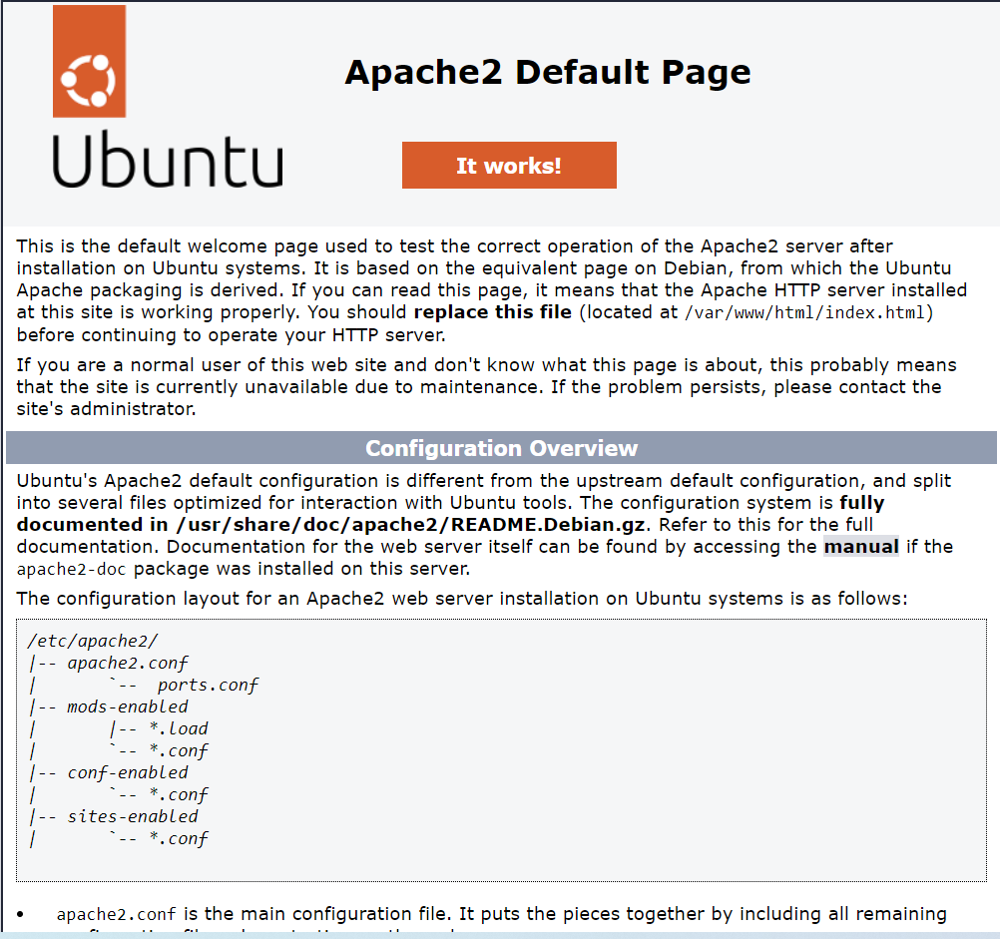

# containers03
# Utilizarea containerelor ca medii de execuție

## Scopul

Această lucrare de laborator are ca scop familiarizarea cu comenzile de bază ale OS Debian/Ubuntu. De asemenea, aceasta va permite să vă familiarizați cu Docker și comenzile sale de bază.

## Sarcina

Pornind de la imaginea oficială a sistemului de operare Ubuntu, să se creeze un container care să conțină un server web Apache. Să se creeze o pagină web care să conțină textul "Hello, World!" și să se afișeze într-un browser.

## Instructiuni

1. **Pornirea și testarea:**

   Deschideti terminalul in directorul 'containers03' și executati următoarea comanda pentru a porni un container Ubuntu și a accesa terminalul sau interactiv:

   ```bash
   docker run -ti -p 8000:80 --name containers03 ubuntu bash
   ```

   În fereastra terminalului containerului, executați următoarele comenzi:

   ```bash
   apt update
   ```
   ```bash
   apt install apache2 -y
   ```
   ```bash
   service apache2 start
   ```
2. **Testarea paginii web:**

   Deschideți un browser și accesați adresa http://localhost:8000. Ar trebui să vedeți pagina web implicită Apache.

   

   În continuare, executați următoarele comenzi în terminalul containerului:

   ```bash
   ls -l /var/www/html/
   ```
   ```bash
   echo '<h1>Hello, World!</h1>' > /var/www/html/index.html
   ```

   Reîmprospătați pagina în browser. Ar trebui acum să vedeți textul "Hello, World!" afișat pe pagină.

   

3. **Explorarea configurării Apache:**

   Executați următoarele comenzi în terminalul containerului:

   ```bash
   cd /etc/apache2/sites-enabled/
   ```

   ```bash
   cat 000-default.conf
   ```

   - Afișează conținutul fișierului de configurare pentru site-ul implicit Apache.

4. **Finalizare și curățare:**

   Închideți fereastra terminalului containerului cu comanda 'exit'.

   Afișați lista de containere Docker în terminalul gazdă:

   ```bash
   docker ps -a
   ```

   Ștergeți containerul creat anterior:

   ```bash
   docker rm containers03
   ```